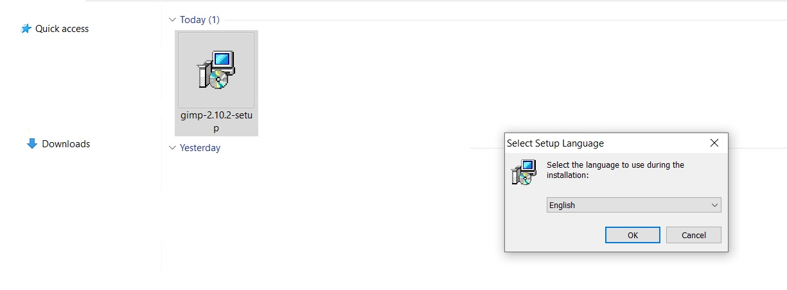
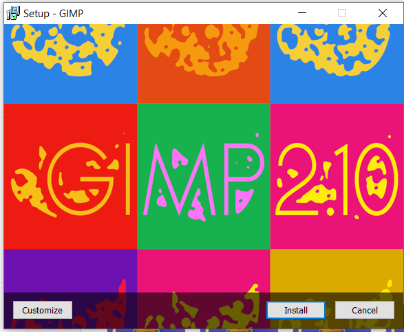
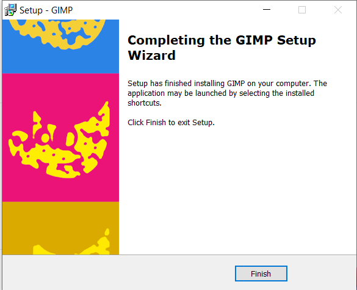

# GIMP

1. [Instalasi](#instalasi)
2. [Penugasan](#penugasan)

## Instalasi

- File GIMP 2.10.2 ([Download](https://download.gimp.org/gimp/v2.10/windows/gimp-2.10.2-setup.exe))

### 2. Cara Instalasi

1. Download file instalasi melalui link di atas.
2. Setelah selesai, buka file instalasi dan install.

3. Tunggu sampai proses instalasi selesai.

## Penugasan

Berikut adalah beberapa latihan yang harus dilakukan sebelum kelas selanjutnya dimulai.

1. Mengaplikasikan fitur brigtness pada GIMP pada gambar.
2. Mengaplikasikan panorama projection pada gambar.
